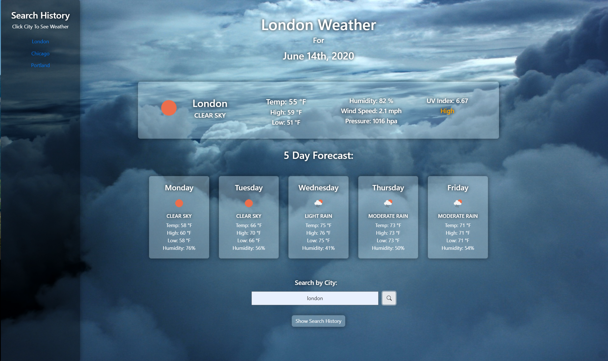

# Weather-Dashboard

## Getting Started

On this homework assignment I was tasked with creating a weather dashboard. It is stylish and minimal. It has a rotating background of seasonal images, and a sleek design. Enter the city query in the text input box and it will return current live weather data, and a 5 day forecast. The site also logs your search history. When you first visit the site, you can click on one of your past searches and it will search that city again. 

## Deployment Link

https://keithbillings.github.io/Weather-Dashboard/

## Screenshots

The Default view on first visit:

When you search for results, the website populates: 

Clicking on the show history button brings up a sidebar:

## What I Did

  * Initalize files
  * Add background that cycles images
  * Add styling via CSS
  * Build website header that will change based on user search
  * Make search input make an AJAX query to see current weather conditions
  * Use previous AJAX query to lift the city's lattitude and longitude to make a second AJAX query for the city's UV Index
  * Use search input to make an AJAX query to see forecasted weather data, and limit it to 5 days
  * Add a show history button that toggles a sidebar
  * Make search input form a local storage array with JSON stringify 
  * Populate sidebar with search history array with JSON parse
  * Debug

## Author

Keith Billings